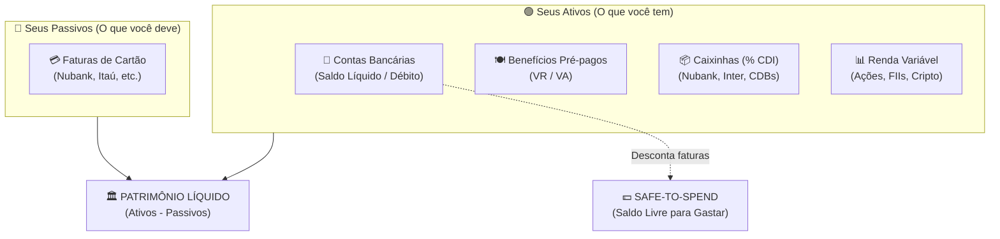

# 🦅 Guia Completo de Uso do Guará IA (MyFinances)

Este guia prático foi criado para você dominar todas as ferramentas do **Guará IA**: desde o registro do seu primeiro cafezinho até o acompanhamento em tempo real do seu **Patrimônio Consolidado**, **Caixinhas com rendimento CDI** e **Saldo Livre (Safe-to-Spend)**.

---

## 🧭 Como o Guará IA Organiza Seu Dinheiro

Ao contrário de planilhas e apps tradicionais que apenas anotam gastos, o Guará IA opera com **4 camadas financeiras conectadas**:



1. **Contas Correntes (Líquido)**: Dinheiro na sua conta do banco (Nubank, Inter, Itaú) para débito e PIX.
2. **Benefícios Pré-pagos (VR / VA)**: Saldo específico para refeição e alimentação que você não mistura com a conta corrente.
3. **Caixinhas & Renda Fixa**: Reservas de emergência e objetivos que rendem porcentagem do CDI (ex: Nubank 115% CDI).
4. **Faturas de Cartão de Crédito**: Gastos parcelados e compras a prazo que vencerão no final do mês.

---

## 🚀 Passo 1: Conciliando seu Ponto de Partida (Setup Inicial)

Para que o bot mostre valores reais, a primeira coisa a fazer é calibrar quanto dinheiro você tem em cada lugar.

### 1. Definir o saldo da sua conta corrente
Você pode usar o comando rápido ou simplesmente falar em português:
```text
/ajustar_saldo Nubank 2500
```
*Ou fale naturalmente:*
> *"Tenho 2500 na conta do Nubank"*

### 2. Cadastrar e definir o saldo do seu Vale Refeição / Alimentação
Primeiro, garanta que o seu vale está cadastrado como benefício:
```text
/cartao add VR 1 vr
```
Em seguida, ajuste o saldo que você tem disponível no cartão de benefício:
```text
/ajustar_saldo VR 850
```
*Ou fale naturalmente:*
> *"Meu saldo no VR é 850"*

---

## 💰 Passo 2: Registrando Entradas de Dinheiro

Sempre que entrar dinheiro (salário do mês, recarga da empresa, freela ou PIX recebido), você **não precisa digitar comandos**. Basta mandar uma mensagem no chat:

### Exemplos reais:
* *"Caiu meu salário de 5200 no Nubank"*
* *"Recarga do VR de 800"*
* *"Recebi 1500 de um freela no Inter"*
* *"João me fez um pix de 120 da pizza"*

O bot responde confirmando a entrada, a conta que recebeu o dinheiro e o novo saldo atualizado.

---

## 🛒 Passo 3: Gastos do Dia a Dia (Débito, Crédito e VR)

O Guará IA entende o meio de pagamento e a conta de onde o dinheiro deve sair:

### 1. Gastos de Refeição (debita do VR):
> *"Almoço de 45 reais no VR"*
> *"Lanche de 28 no vale refeição"*
* O bot deduz os 45 reais do saldo pré-pago do seu VR, sem mexer no saldo do seu banco.

### 2. Gastos no Débito ou PIX (debita da Conta Bancária):
> *"Mercado 160 no débito"*
> *"Gasolina 100 no pix"*
* O bot registra a compra na categoria correta e deduz imediatamente do saldo da conta corrente.

### 3. Gastos no Cartão de Crédito (vai para a Fatura):
> *"Tênis de 350 em 3x no Nubank"*
> *"Farmácia 75 no crédito"*
* O bot agenda as parcelas para as faturas corretas conforme a data de fechamento do cartão. Seu saldo bancário não diminui hoje, mas sua fatura aumenta.

### 4. Gastos Divididos (Split de Contas):
> *"Jantar 120 dividido em 3 com João e Maria"*
* O bot registra que seu gasto real foi de R$ 40,00 e anota que João te deve R$ 40,00 e Maria te deve R$ 40,00!

---

## 💵 Passo 4: Entendendo o Safe-to-Spend (`/saldo`)

### A Armadilha do Saldo Ilusório:
Imagine que você abre o aplicativo do banco e vê **R$ 3.000,00**. Você pensa: *"Posso comprar este videogame de R$ 1.500!"*.
Porém, sua fatura de cartão de crédito fecha em 5 dias e está em **R$ 2.400,00**. Se você gastar os R$ 1.500, você ficará no cheque especial e não conseguirá pagar a fatura!

### Como o `/saldo` resolve isso:
O comando `/saldo` calcula o seu **Safe-to-Spend** (Saldo Seguro para Gastar):

$$\text{Safe-to-Spend} = \text{Saldo Real em Conta} - \text{Faturas Abertas a Pagar}$$

Ao enviar `/saldo`, você recebe:
```text
💳 VISÃO DE SALDO & SAFE-TO-SPEND

🏦 Conta: Nubank
💵 Saldo Real em Conta: R$ 3.000,00
🧾 Faturas de Cartão Abertas: R$ 2.400,00
🟢 Saldo Livre para Gastar: R$ 600,00

🍽 Benefícios Pré-pagos:
  • VR: R$ 780,00
```
Você sabe exatamente que tem apenas **R$ 600,00** verdadeiramente livres, protegendo você de dívidas surpresa!

---

## 🏛 Passo 5: Seu Patrimônio Consolidado (`/patrimonio`)

O comando `/patrimonio` reúne tudo o que você tem e tudo o que você deve em uma visão contábil em blocos, com porcentagens e barras gráficas:

$$\text{Patrimônio Líquido} = \text{Total de Ativos} - \text{Total de Faturas de Cartão}$$

### Relatório retornado pelo `/patrimonio`:
```text
🏛 SEU PATRIMÔNIO CONSOLIDADO
━━━━━━━━━━━━━━━━━━━━━━━━━━━━
💰 Patrimônio Líquido: R$ 24.580,00
_(Total Ativos: R$ 26.980,00 − Faturas: R$ 2.400,00)_

💧 Liquidez Imediata Livre: 🟢 R$ 600,00
_(Disponível em conta corrente após pagar as faturas abertas)_

━━━━━━━━━━━━━━━━━━━━━━━━━━━━
📊 DISTRIBUIÇÃO DE ATIVOS
━━━━━━━━━━━━━━━━━━━━━━━━━━━━

🏦 Contas Correntes: R$ 3.000,00 (11%)
`[█░░░░░░░]`
  • Nubank: R$ 3.000,00

🍽 Benefícios (VR / VA): R$ 780,00 (3%)
`[░░░░░░░░]`
  • VR: R$ 780,00

📈 Caixinhas & Renda Fixa: R$ 15.200,00 (56%)
`[████░░░░]`
  • Reserva de Emergência (115% CDI): R$ 15.000,00 _(rendeu bruto +R$ 230,00)_

📊 Renda Variável: R$ 8.000,00 (30%)
`[██░░░░░░]`
  _Rentabilidade Total: +R$ 450,00 (+5.96%)_
  • PETR4: 100x a R$ 38,50 = R$ 3.850,00 (+8.2%)
  • HGLG11: 25x a R$ 166,00 = R$ 4.150,00 (+3.9%)

━━━━━━━━━━━━━━━━━━━━━━━━━━━━
💳 PASSIVOS & OBRIGAÇÕES
━━━━━━━━━━━━━━━━━━━━━━━━━━━━
*Total de Faturas a Pagar:* R$ 2.400,00
  • Nubank: R$ 2.400,00
```

> **Ações Rápidas Inline:** A mensagem acompanha 5 botões integrados:
> - `[🔄 Atualizar CDI]`: recalcula e credita rendimentos no saldo.
> - `[📈 Investimentos]`: detalha caixinhas e cotações.
> - `[💵 Saldo Livre]`: consulta imediata ao Safe-to-Spend.
> - `[💳 Faturas]`: detalhamento das faturas do cartão.
> - `[⚖️ Conciliar Contas]`: atalho para conferir e ajustar saldos com `/ajustar_saldo`.

---

## 📦 Passo 6: Caixinhas com Rendimento CDI Transparente (`/investimentos`)

O Guará IA possui um motor matemático de cálculo de renda fixa integrado com a **API oficial do Banco Central do Brasil (SGS Série 12)**:

1. **Taxa CDI Real**: Busca a taxa diária oficial divulgada pelo Bacen.
2. **Dias Úteis**: Conta apenas dias úteis entre a data de aplicação e hoje (desconsidera fins de semana e feriados nacionais).
3. **IR Regressivo Automático**:
   * Até 180 dias: **22,5%**
   * 181 a 360 dias: **20,0%**
   * 361 a 720 dias: **17,5%**
   * Mais de 720 dias: **15,0%**
4. **IOF**: Aplica a tabela regressiva de IOF para resgates antes de 30 dias.

No comando `/investimentos`, você vê o extrato transparente:
* **Saldo Bruto**: o valor acumulado com juros compostos.
* **Rendimento Bruto**: quanto seu dinheiro trabalhou.
* **Provisão de IR**: o imposto que seria retido na fonte.
* **Saldo Líquido de Resgate**: quanto cairia na sua conta hoje se resgatasse.

---

## 🧭 Tabela de Comandos Rápidos

| Comando | O que faz |
|---|---|
| `/start` | Onboarding pedagógico e botões de início rápido |
| `/ajuda` ou `/tutorial` | Central interativa de tutoriais navegável por tópicos |
| `/comandos` | Lista completa e categorizada de todos os comandos |
| `/patrimonio` | Visão 360° do patrimônio líquido consolidado com barras de alocação |
| `/saldo` | Saldo bancário real vs Safe-to-Spend (saldo livre) |
| `/investimentos` | Caixinhas (% CDI com rendimento e IR) e ações |
| `/ajustar_saldo <conta> <valor>` | Define ou concilia o saldo de uma conta ou VR |
| `/resumo` | Balanço do mês (gastos por categoria, receitas e alertas) |
| `/fatura` | Fatura atual e futuras do cartão de crédito |
| `/dividas` | Quem te deve e despesas divididas |
| `/gastos [n]` | Exibe os últimos $n$ lançamentos (padrão: 5) |
| `/grafico` | Gera imagem PNG com distribuição gráfica de gastos |
| `/insight` | Diagnóstico financeiro e projeção gerada por IA |
| `/cartao` | Gerenciamento de cartões de crédito e vales |
| `/meta` | Acompanhamento de tetos de gastos por categoria |
| `/poupanca` | Metas de longo prazo com cálculo de aporte mensal |
| `/pago <nome> [valor]` | Dá baixa em dívidas que amigos te pagaram |
| `/desfazer` | Cancela imediatamente o último lançamento |
| `/exportar` | Exporta seus lançamentos em planilha CSV |
